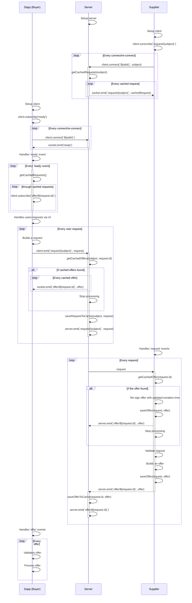

# Pub/Sub server

Centralized pub/sub server dedicated to the coordination of buyers and suppliers in the WindingTree Market protocol.

## Architecture

```mermaid
graph LR
dapp[Buyer<br>Dapp]
node[Supplier<br>node]
nginx[Nginx<br>reverse<br>proxy]
style container stroke-dasharray:5 5;
style app2 fill:transparent;
style app3 fill:transparent;
style appN fill:transparent;
subgraph container[ ]
    subgraph node.js app
        subgraph Express.js
            socket[Socket.Io]
            handlers[Workflow<br>handlers]
        end
        subgraph <br>Storage<br>abstraction
            db[DB<br>connector]
        end
    end
    app2[App instance #2]
    app3[App instance #3]
    appN[App instance #n]
end
subgraph Database
    requests[(Requests<br>cache)]
    offers[(Offers<br>cache)]
end
node --- |wss|nginx
dapp --- |wss|nginx
nginx --- |ws|socket
nginx --- |ws|app2
nginx --- |ws|app3
nginx --- |ws|appN
socket --- handlers
handlers --- db
db --- requests
db --- offers
```

> MVP of the Pub/Sub server will not authenticate connections.
> Next version of the server will use JWT-based authorization schema. To the architecture will be added special `Authorization` server that will validate suppliers identity and generates a secured JWT

## Workflow



## Storage abstraction

- key-value storage
- Must support the following options: in-memory, Redis
- Every record must have TTL. Expired records must be removed from storage

## Glossary

- Transaction: a completed interaction between a buyer and supplier that includes the following steps:
  - Publication of the request on the pub/sub server
  - Handling of the request on the server
  - Obtaining the request by the supplier
  - Processing the request by the supplier and generation of the offer
  - Publishing of the offer by the supplier
  - Handling of the offer on the server
  - Obtaining the offer by the buyer

## Performance and quality metrics

- ATT: Average transaction time, the average time of the transaction in the measured time interval with one buyer and one supplier connected.
- BCP: The buyers capacity, the maximum number of connected buyers clients that can be handled by the server, in the measured time interval, without decreasing of ATT by more than 50% with the ONE supplier node connected. During the calculation of the metric, every connected buyer client is generating unique requests in the amount of 1 per second (this value can be adjustable).
- SCP: The suppliers capacity, the maximum number of suppliers clients connected to the server, in the measured time interval, without decreasing of ATT by more than 50% with the ONE supplier node connected. During the calculation of the metric, one buyer client must be connected to the server and generates 1 unique request per second (this value can be adjustable).
- TPS: The number of transactions per second at BCP.
- MEM: The average server memory consumption at BCP and SCP.

## Scalability

The solution performance can be increased in the following ways:

- By upgrading of the server host parameters: CPU type and number of cores, memory size
- By using of the reverse proxy as a load balancer that routes connections and traffic to the multiple instances of the server node.js application. Number of the CPU cores of the server host must be = node.js app instances number + 1
- By using a scalable database on the backend. For example Redis DB clusterisation and shards.
- The more radical solution may be transforming the server into a multi-server p2p network. This solution may increase BCP and SCP but will reduce general workflow performance specifically the ATT will increase.
